

 
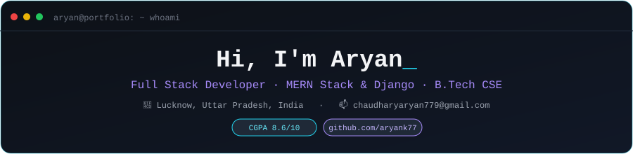

 

## 💼 Featured Projects

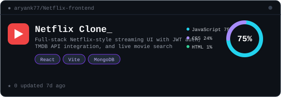 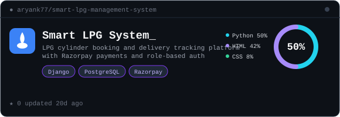
  
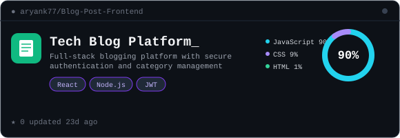

 

## 🧠 About Me

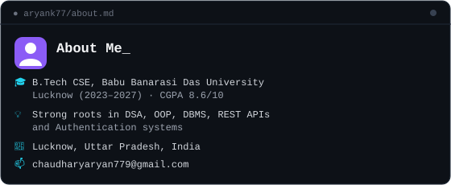

 

## 🚀 Skills

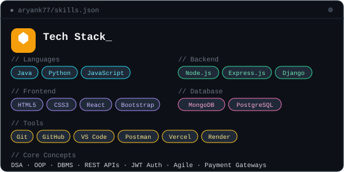

 

## 🏆 Certifications

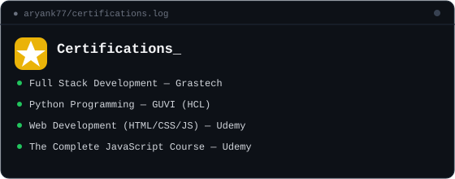

 

## 💻 Virtual Internships

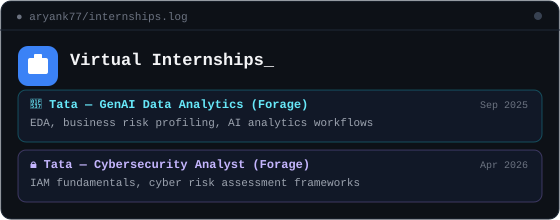

 

## 📊 GitHub Activity

📈 Stats Overview &nbsp;&nbsp;|&nbsp;&nbsp;  
 
 
 
🧑‍💻 Top Languages**
 

  

**🔥 Contribution Streak**
 
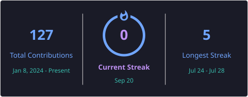

  

## 📌 Pinned Repos


 

### 🤝 Let's Connect

